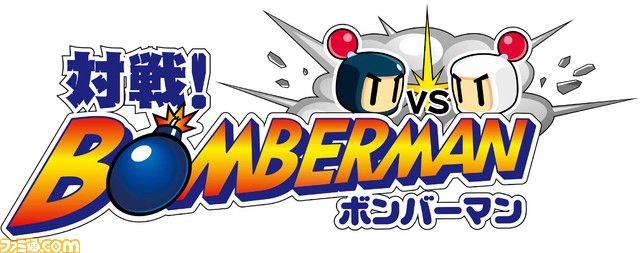
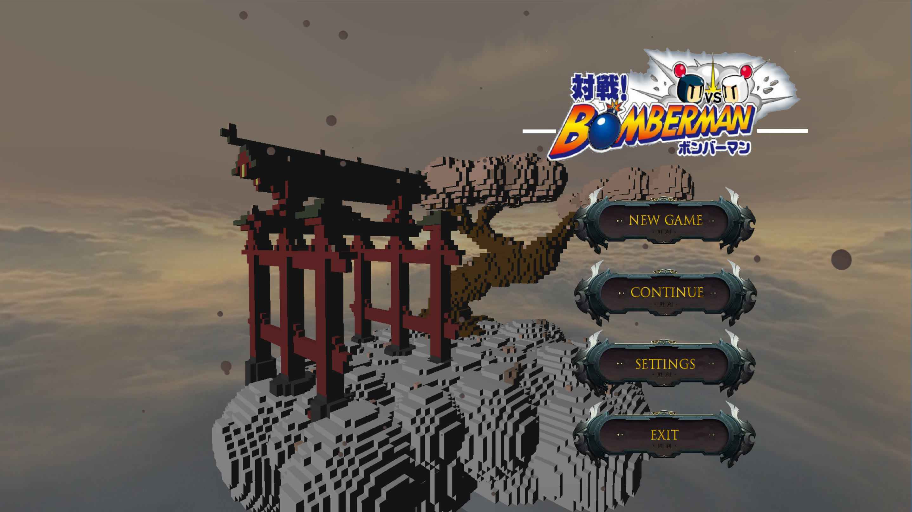
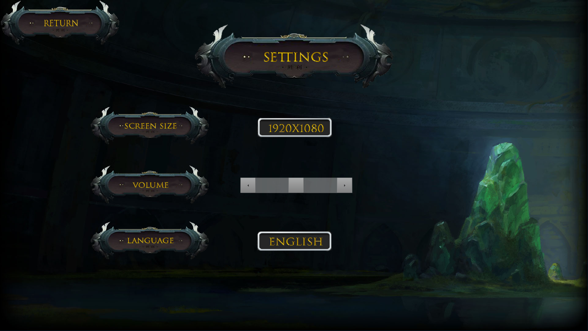
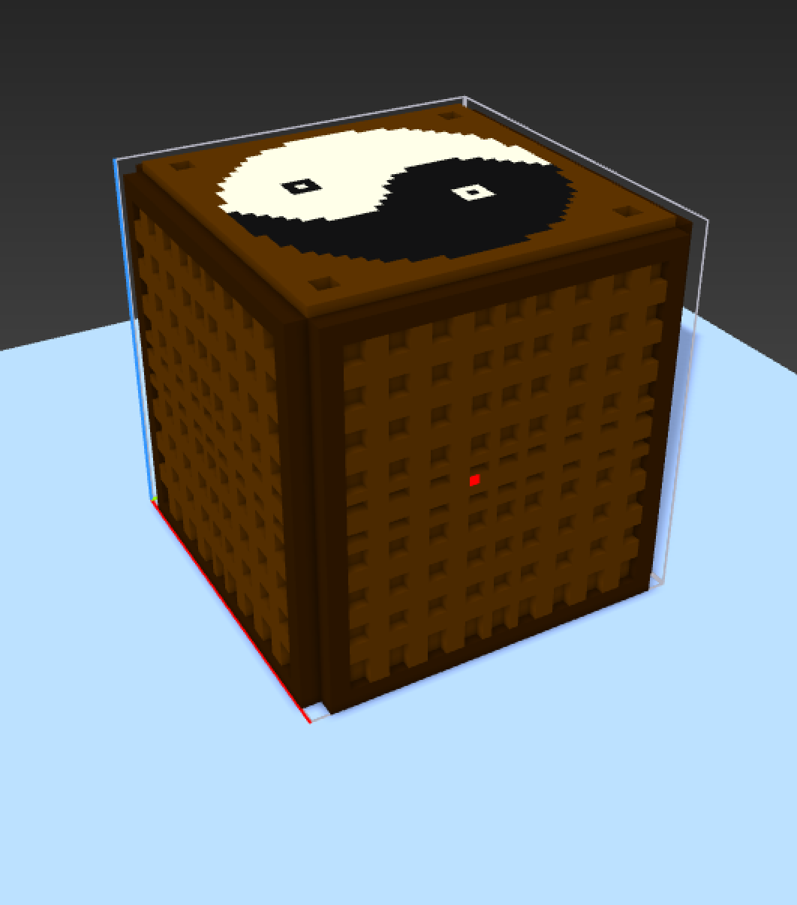
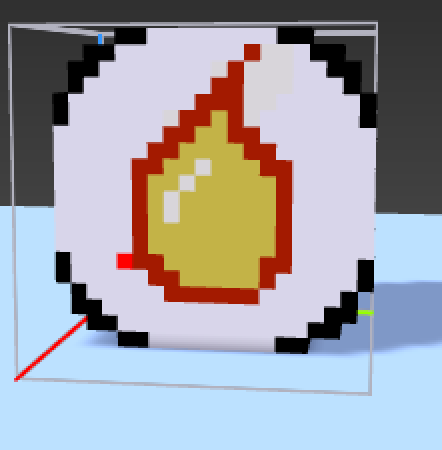
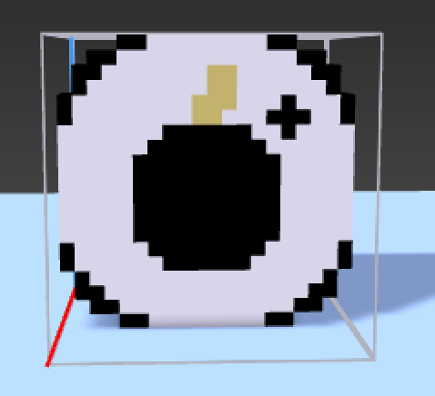
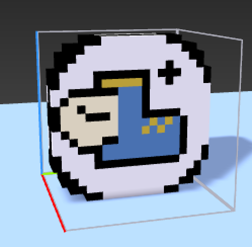
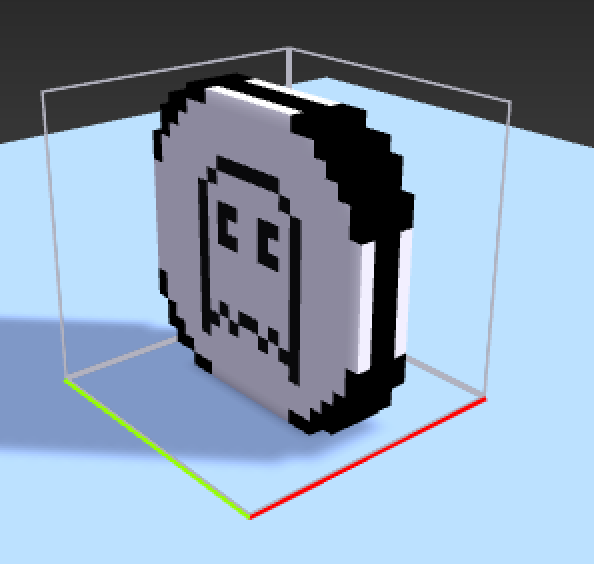
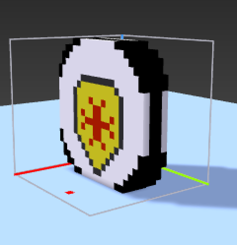
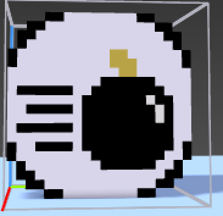

<p align="center">
	
</p>

# BOMBERMAN SAKURA — A Linux / Windows Cross Platform Game

***In BOMBERMAN SAKURA it exists a green stone with mysterious powers : the jade stone. You are the Bomberman Sakura, the legendary Sakura's tree warrior, and you must destroy all the others Bombermen to gain the jade stone.***

## Menu



You can start a new game by pressing the **NEW GAME** button.<br>
You can continue a saved game by pressing the **CONTINUE** button.<br>
You can access to the settings of the game by pressing the **SETTINGS** button.<br>
And you can exit the game by pressing the **EXIT** button.<br>

## Characters Selection


You can return to the menu by pressing the **RETURN** button.<br>
You can choose your character and set the number of AI and players by clicking on the character's card.<br>
You can also choose the size of the map by scrolling the size bar (from 1 to 5).<br>
You can start the game by pressing the **PLAY** button.<br>

## Settings



You can choose the screen size with **SCREEN SIZE**.<br>
You can ajust the volumu by scrolling the volume bar.<br>
You can choose your language with **LANGUAGE**.<br>

## Gameplay

<p>
	<span style=padding-bottom:150PX>- You can destroy these boxes with a bomb and maybe obtain a powerup.</span>
</p>
<p>
	<span style=padding-bottom:150PX>- This powerup increase your blast power.</span>
</p>
<p>
	<span style=padding-bottom:150PX>- This powerup increase your number of bomb you can drop.</span>
</p>
<p>
	<span style=padding-bottom:150PX>- This powerup increase your speed.</span>
</p>
<p>
	<span style=padding-bottom:150PX>- With this powerup you can go through boxes and bombs.</span>
</p>
<p>
	<span style=padding-bottom:150PX>- This powerup make you invicible for ONE blast.</span>
</p>
<p>
	<span style=padding-bottom:150PX>- With this powerup you can kick bombs.</span>
</p>

## Commands

### Player 1

Z -> Move up<br>
S -> Move down<br>
Q -> Move left<br>
D -> Move right<br>
SPACE -> Drop bomb<br>

### Player 2

KEY_UP -> Move up<br>
KEY_DOWN -> Move down<br>
KEY_LEFT -> Move left<br>
KEY_RIGHT -> Move right<br>
ENTER -> Drop bomb<br>

## Compilation

### Linux

```mermaid
mkdir build && cd build && cmake .. && make && ..
./bomberman
```

### Windows

```mermaid
mkdir build && cd build && cmake .. && cmake --build . && .. && mv .\Debug\* .
./bomberman.exe
```

## Features Incoming

Skins<br>
Settings Menu functionnal<br>
Pause Menu<br>
Better AI<br>
Restart button<br>

## Contributing

* **Epitech**
* **Epitech Nice**

## Authors

* **Rolino Théo** - *Lead Dev*
* **Iliassov Chamil** - *Dev Core*
* **Choquet Vincent** - *Dev Map/Game*
* **Kiryk Valentin** - *Dev Players*
* **Loche Joachim** - *Dev Windows*
* **Lucas Victor** - *Dev AI*
